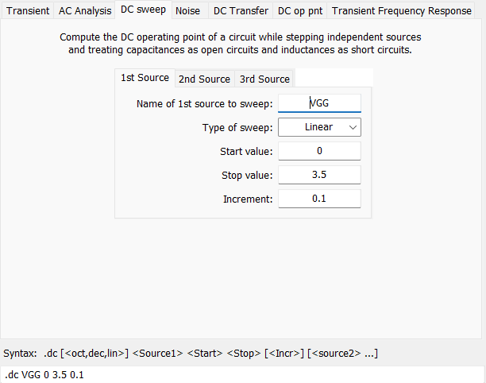
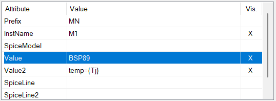
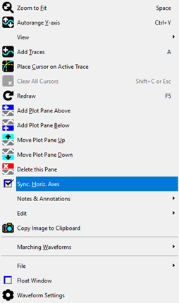
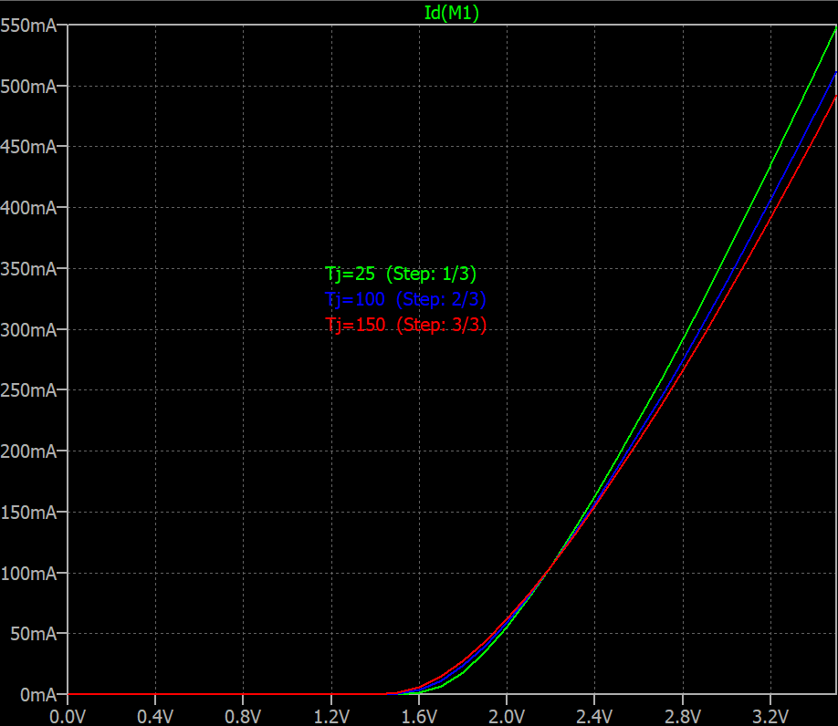
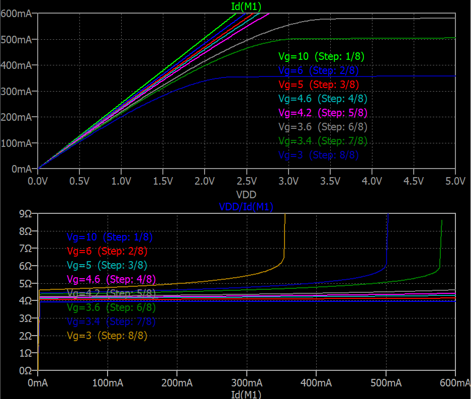

# Example Description

In this set of simulations, the characteristic curves of the BSP89 MOSFET (Infineon) are obtained using LTspice.

- `bsp89_input_charac.plt`: Transfer characteristic of the transistor  
  ($I_{D} = f(V_{GS})$)

- `bsp_output_charac.plt`: Output characteristic and on-resistance curves  
  ($I_{D} = f(V_{DS})$ and $R_{DS} = f(V_{DS})$)

---

## 1. DC Sweep Analysis

The **DC sweep analysis** computes the operating point of a circuit while sweeping one or more independent sources.

During this analysis:
- Capacitors are treated as **open circuits**
- Inductors are treated as **short circuits**
- The solution corresponds to a sequence of DC operating points



---

## 2. Transfer Characteristic — `bsp89_input_charac.plt`

In this simulation, the drain current ($I_D$) is evaluated as a function of the gate-source voltage ($V_{GS}$).

### Simulation Setup

The $V_{GS}$ voltage is swept using the `.dc` directive:

- **Source to sweep**: `VGG`
- **Sweep type**: Linear
- **Start value**: 0 V
- **Stop value**: 3.5 V
- **Increment**: 0.1 V

> Example directive:
```spice
.dc VGG 0 3.5 0.1
```
This produces the transfer curve $I_D \cdot V_{GS}$.

### Simulation Setup
The $V_{DS}$ voltage is swept using the `.dc` directive:

---

## 3. Output Characteristic — `bsp_output_charac.plt`

In this simulation, the drain current ($I_D$) is evaluated as function of ($V_{DS}$) and on-resistance ($R_{DS}$) as functions of the drain current ($I_{DS}$) for different gate voltages.

### Simulation Setup

The $V_{DS}$ voltage is swept using the `.dc` directive:

- **Source to sweep**: `VDD`
- **Sweep type**: Linear
- **Start value**: 0 V
- **Stop value**: 5 V
- **Increment**: 0.01 V

> Example directive:
```spice
.dc VDD 0 5 0.01
```
Additionally, the gate voltage ($V_{GS}$) is stepped using the `.step` directive to obtain multiple curves:

> Example:
```spice
.step param VGG list 1 1.5 2 2.5 3
```

This produces a family of curves:
- $I_D \cdot V_{DS}$
- $R_{DS} \cdot V_{DS}$

---
## 4. Temperature Configuration

The simulation temperature has a significant impact on MOSFET behavior.

In LTspice, the global simulation temperature is defined by the parameter `temp`. The default value is **27°C**.

### 4.1 Global Temperature

To set a fixed simulation temperature:
```spice
.temp 25
```
---

### 4.2 Temperature Sweep

To evaluate the circuit at multiple temperatures, use the `.step` directive:

```spice
.step param Tj list 25 100 150
```
---

### 4.3 Device-Specific Temperature

It is possible to assign a temperature to a specific component by defining its attribute as:

```spice
temp = {Tj}
```

in the component attribute editor.




---

### Application in `bsp89_input_charac.plt`

- Global temperature:  
```spice
.temp 25
```

- Junction temperature sweep:
```spice
.step param Tj list 25 100 150
```

- MOSFET temperature definition:
```spice
temp = {Tj}
```

## 5. Customizing Plot Axes in LTspice
LTspice allows plotting variables against arbitrary quantities (not limited to time).

This feature is particularly useful for extracting characteristic curves.

### 5.1 Multiple Plot Panes

- Right-click on the plot window
- Select **"Add Plot Pane"**

This creates independent graph areas.

---

### 5.2 Independent Horizontal Axes

- Right-click inside the plot area
- Disable **"Sync. Hor. Axes"**

Each pane can now use a different x-axis variable.



---

### 5.3 Changing the X-Axis Variable

- Right-click on the horizontal axis
- Enter a new expression in **"Quantity Plotted"**

---

## 6. Expected Results

### 6.1 Transfer characteristic — `bsp89_input_charac.plt`

The transfer characteristic of the BSP89 for different operating temperature is demonstrated below.




### 6.2 Output characteristic - `bsp89_output_charac.plt`

The output characteristics of the BSP89 for giferent $V_{GS}$ values is demonstrated below.



## 6. Key Takeaways

- `.dc` analysis is essential for extracting MOSFET characteristic curves
- `.step` enables parametric sweeps (e.g., voltage or temperature)
- Temperature significantly affects device behavior and must be considered
- LTspice supports flexible plotting, including custom x-axis variables
- Combining `.dc` and `.step` allows generating complete families of curves

---

## References

- SPICE Course for Electronic Simulation – Part 16  
https://www.powerelectronicsnews.com/spice-course-for-electronic-simulation-part-16-graphs-with-abscissas-different-from-time/
